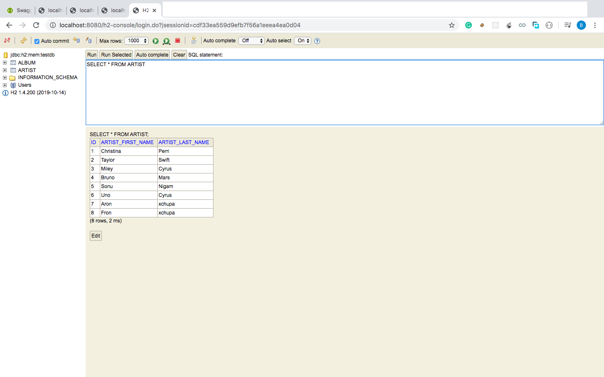

### README file ###

* ARTISTS ENDPOINTS
  * `/artists` endpoint to manage Artist data. 
      * `POST /artists` to save a new artist
      * `PUT /artists/{artistId}` to update an existing artist
      * `GET /artists` lists all artists. 
        * filtering by a part of artist name
        * sorting by artist name (asc/desc)
        * paging

* ALBUMS ENDPOINTS
  * `/artists/{artistId}/albums` endpoint to manage Album data. 
      * `POST /artists/{artistId}/albums` to add a new album to an existing artist
      * `PUT /artists/{artistId}/albums/{albumId}` to update an existing album
      * `GET /artists/{artistId}/albums` lists all albums by the given artist. 
        * filtering by genre(s)
        * sorting by album name and release year (asc/desc)
        
 *DATABASE
 *H2 Database. H2 is a in-memory sql database.Easy to setup.
 These databases are directly created inside the application.The Schemas are defined, the tables are created,the data is populated 
 and once the application stops, the entire database is destroyed and removed from memory.
 The great thing about these databases is you don't really need to maintain them.
 
 *SWAGGER
 
 
 *DATABASE
 
 
 
 
 
 
 
 
 
